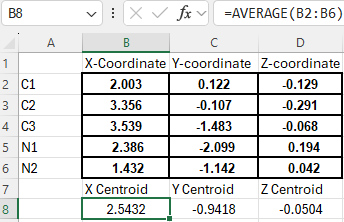
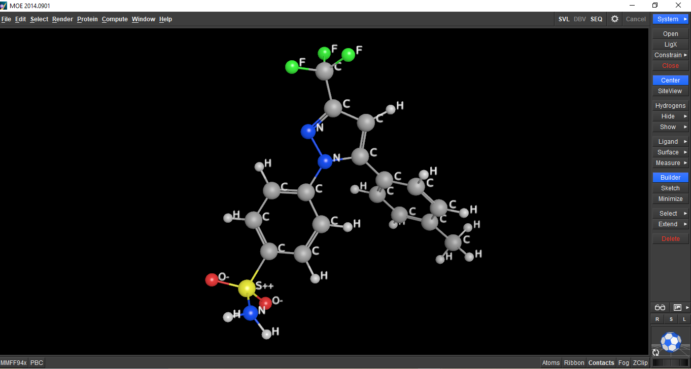
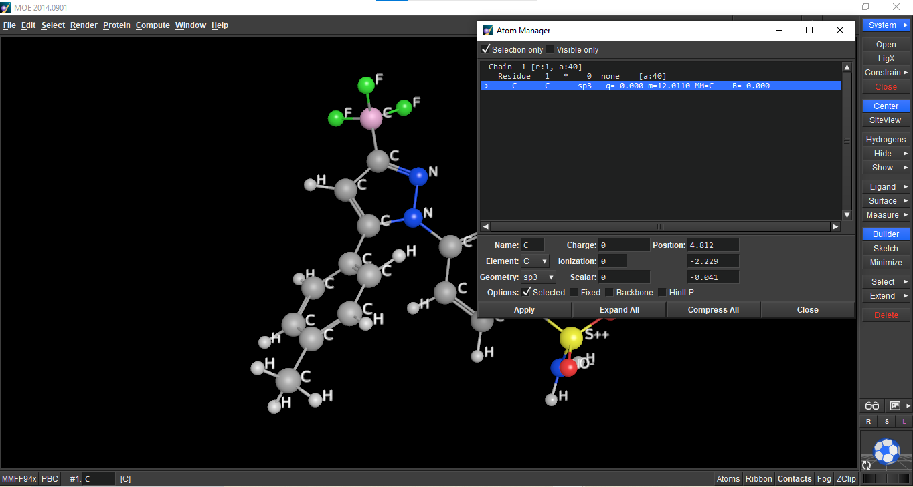
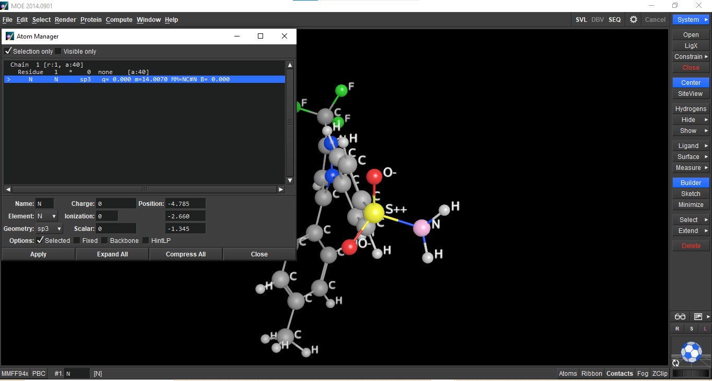
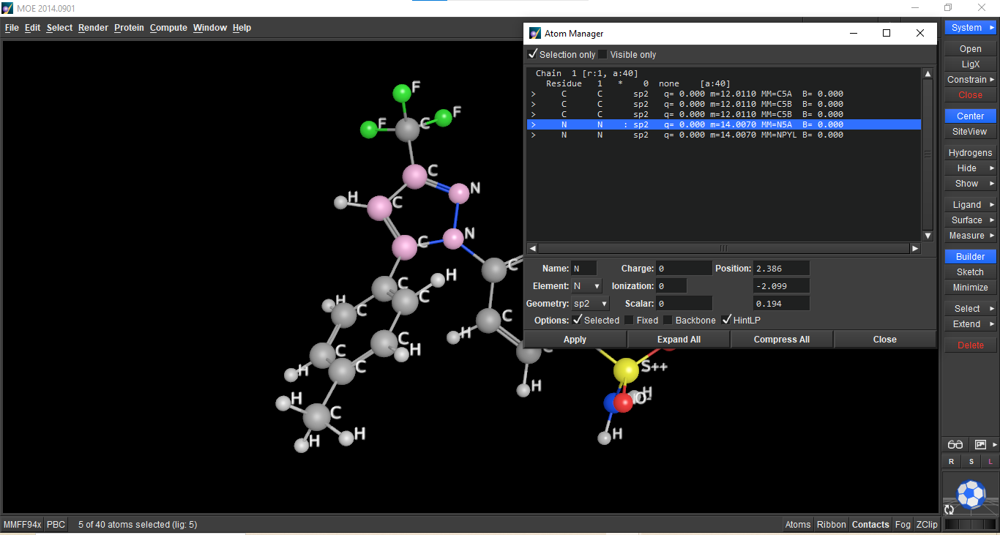

# Manual Pharmacophore Feature Mapping of Celecoxib

## Project Overview

This project presents a manual pharmacophore feature mapping of Celecoxib using MOE (Molecular Operating Environment).

The analysis focuses on identifying key pharmacophore features from the 2D chemical structure and analyzing selected feature coordinates in the 3D conformer.

## Objectives

- Identify the main pharmacophore features of Celecoxib.
- Classify hydrogen bond donors (HBD), hydrogen bond acceptors (HBA), hydrophobic features, and aromatic rings.
- Extract three 3D atomic coordinates using MOE.
- Calculate the geometric centroid of the pyrazole ring.
- Document the analysis and results in a reproducible format.

## Software

- MOE (Molecular Operating Environment)
- Microsoft Excel

## Compound

**Celecoxib**

SMILES:

`CC1=CC=C(C=C1)C2=CC(=NN2C3=CC=C(C=C3)S(=O)(=O)N)C(F)(F)F`

## Pharmacophore Features

| Feature | Type | Structural Feature |
|---|---|---|
| F1 | HBA | Sulfonyl oxygen |
| F2 | HBD | Sulfonamide nitrogen |
| F3 | HBA | Pyrazole nitrogen |
| F4 | Aro | Methylphenyl aromatic ring |
| F5 | Hyd | Trifluoromethyl (CF₃) group |
| F6 | Aro | Benzenesulfonamide aromatic ring |

## 3D Feature Coordinate Analysis

Feature	Representative | Atom                  |	X Coordinate |	Y Coordinate  | Z Coordinate
Sulfonamide Nitrogen   |	N (sulfonamide)      |	-4.784	     |  -2.660       	| -1.345
Trifluoromethyl Carbon |	C (trifluoromethyl)  |	4.812        |	-2.229      	| -0.041
Pyrazole Center        |	Centroid of Pyrazole |	2.5432	     |  -0.9418       |	-0.0504

### Pyrazole Centroid Calculation

The pyrazole centroid was calculated as the arithmetic mean of the
X, Y, and Z coordinates of the five atoms forming the pyrazole ring.

## Results

The identified pharmacophore features and selected 3D coordinates were
obtained from the Celecoxib 3D conformer using MOE.

The geometric centroid of the pyrazole ring was calculated from the
coordinates of its five constituent atoms using Microsoft Excel.

## Visualization
celecoxib_3d_structure

cf3_carbon_coordinates

sulfonamide_nitrogen_coordinates

pyrazole_nitrogen_coordinates

pyrazole_centroid_caculation

## Scientific Notes

The sulfonamide nitrogen acts as a hydrogen bond donor due to its N–H bonds. 
The sulfonyl oxygens and the appropriate pyrazole nitrogen act as hydrogen bond acceptors.

The CF₃ group is classified as hydrophobic rather than a conventional hydrogen bond acceptor. Although fluorine is highly electronegative, its electron density and lone pairs are strongly localized and tightly held, making them energetically less available for conventional hydrogen-bond acceptance.

## Author

**Hilana Mounir**
