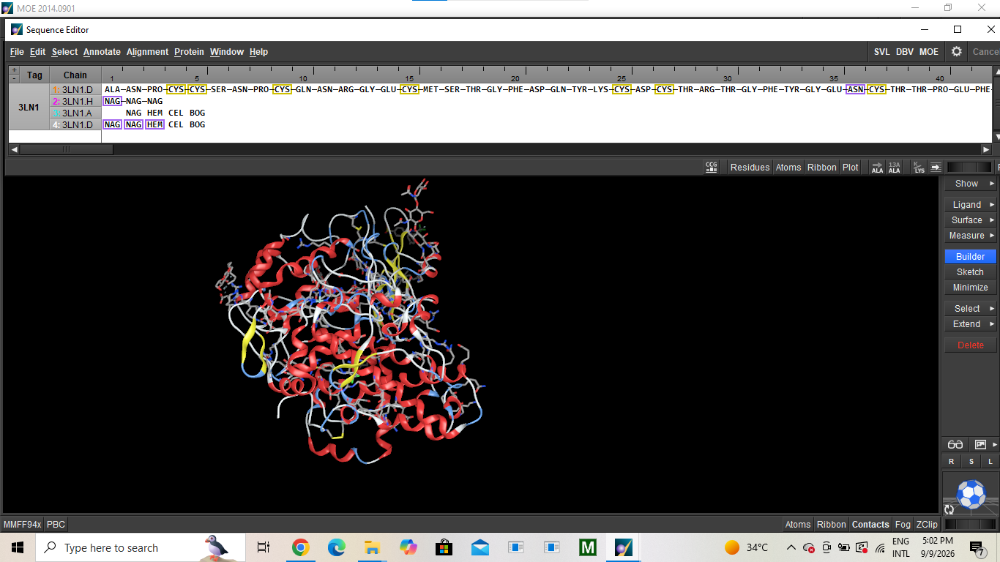
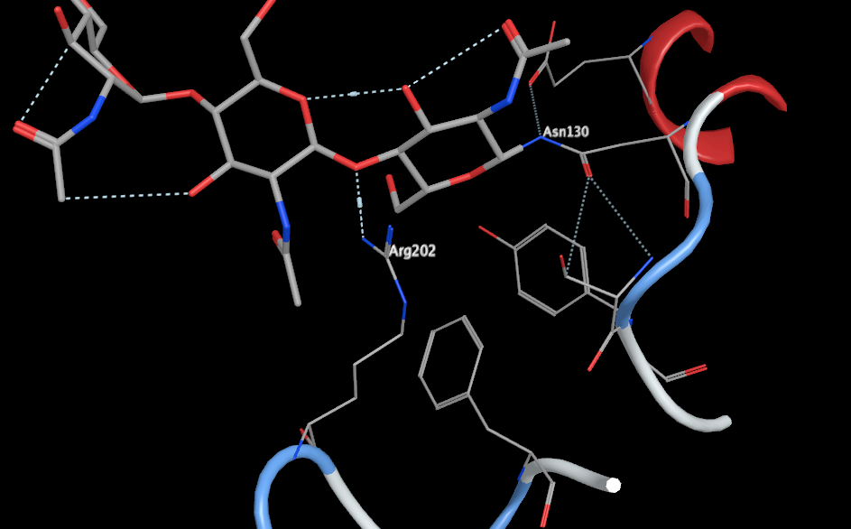
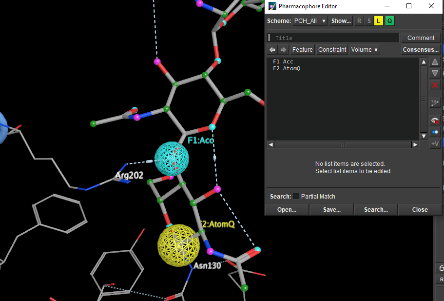
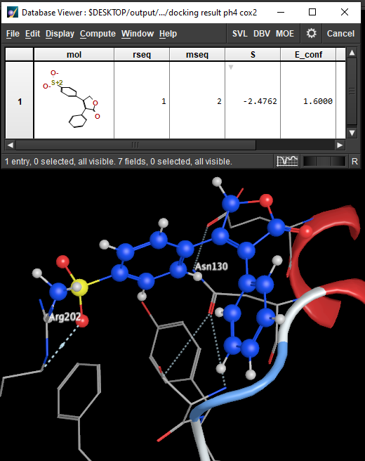

# Project 03: Structure-Based Pharmacophore Modeling

## Project Focus

* **Target:** Cyclooxygenase-2 (COX-2)
* **Reference Ligand:** Celecoxib
* **Approach:** Structure-Based Pharmacophore Modeling & Virtual Screening

---

## Objective

To identify key protein–ligand interactions within the COX-2 binding site and translate them into pharmacophore features for structure-based virtual screening.

---

## Workflow

### 1. Protein–Ligand Complex Preparation

* Started from the **COX-2–Celecoxib complex** obtained from the Protein Data Bank (PDB).
* The complex contained **four similar protein subunits**. Since the subunits have the same structural context, **three subunits were removed and one subunit was retained** for the analysis.
* Working with a single subunit allowed the analysis to remain focused on one representative COX-2 binding site, while the same structural context is present across the corresponding subunits.

**Figure — Protein–ligand complex after retaining one representative subunit.**

---

### 2. Binding-Site Interaction Analysis

* Examined the Celecoxib binding site of the retained subunit to identify key protein–ligand interactions.
* **Arg202** and **Asn130** were identified as key residues used for structure-based pharmacophore generation.

**Figure — Identified binding-site residues (Arg202 and Asn130).**

---

### 3. Structure-Based Pharmacophore Generation

* Generated a pharmacophore model in MOE based on the identified protein–ligand interactions.
* Defined two pharmacophore features corresponding to the selected interactions:

  * **F1: ACC** — associated with **Arg202**
  * **F2: AtomQ** — associated with **Asn130**
* The pharmacophore query was constructed using the **PCH-All** feature scheme.

**Figure — Structure-based pharmacophore query showing the two interaction features.**

---

### 4. Structure-Based Virtual Screening

* Applied the generated pharmacophore query for virtual screening.
* Identified compounds capable of satisfying the defined interaction requirements within the COX-2 binding site.
* A representative screening hit (**CID 5090**) was identified as capable of satisfying the defined interaction requirements.

**Figure — Virtual screening / docking results.**

---

## Structure-Based vs. Ligand-Based Pharmacophore Modeling

| Structure-Based                                 | Ligand-Based                                          |
| ----------------------------------------------- | ----------------------------------------------------- |
| Derived from a protein–ligand complex           | Derived from multiple known ligands                   |
| Uses protein–ligand interactions                | Uses common structural features among ligands         |
| Requires a known target structure               | Does not necessarily require a protein structure      |
| Focuses on interactions within the binding site | Focuses on shared chemical features of active ligands |

---

## Software & Resources

* **Molecular Operating Environment (MOE)**
* **Protein Data Bank (PDB)**

---

## Author

**Hilana Mounir**
